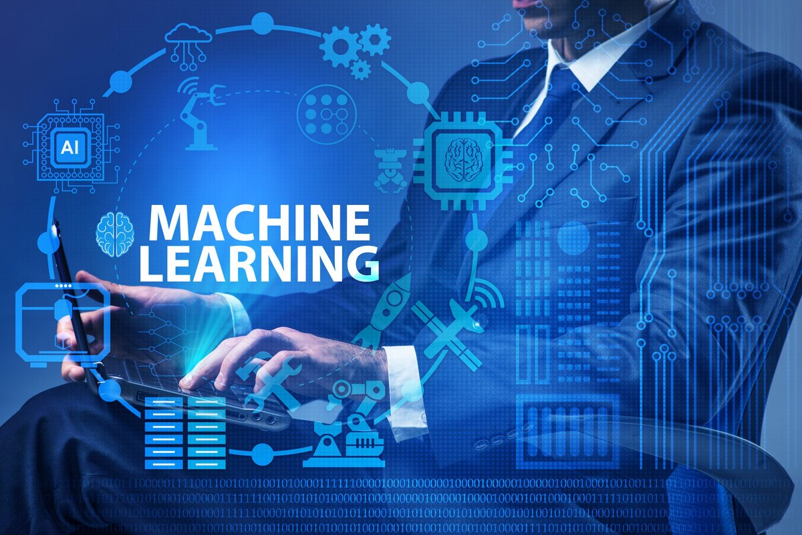

## Что пригодится?

1. Основы статистики и математики. Для успешной работы в машинном обучении необходимо иметь хорошее понимание основных понятий статистики и математики, таких как вероятность, линейная алгебра, оптимизация и теория вероятностей.

2. Программирование на Python. Python является одним из наиболее популярных языков программирования в машинном обучении. На курсах вы изучите основы языка Python и научитесь применять его для решения задач машинного обучения.
3. Алгоритмы и структуры данных. Знание основных алгоритмов и структур данных является важным компонентом успешной работы в машинном обучении. На курсах вы изучите различные алгоритмы машинного обучения, такие как линейная регрессия, деревья решений, случайные леса и нейронные сети.
4. Работа с данными. В машинном обучении данные играют ключевую роль. На курсах вы научитесь собирать, обрабатывать и анализировать данные с использованием различных инструментов и библиотек, таких как Pandas и NumPy.
5. Глубокое обучение. Глубокое обучение является одной из самых актуальных областей машинного обучения. На курсах вы узнаете, как работать с нейронными сетями и использовать их для решения сложных задач, таких как распознавание образов и обработка естественного языка.

